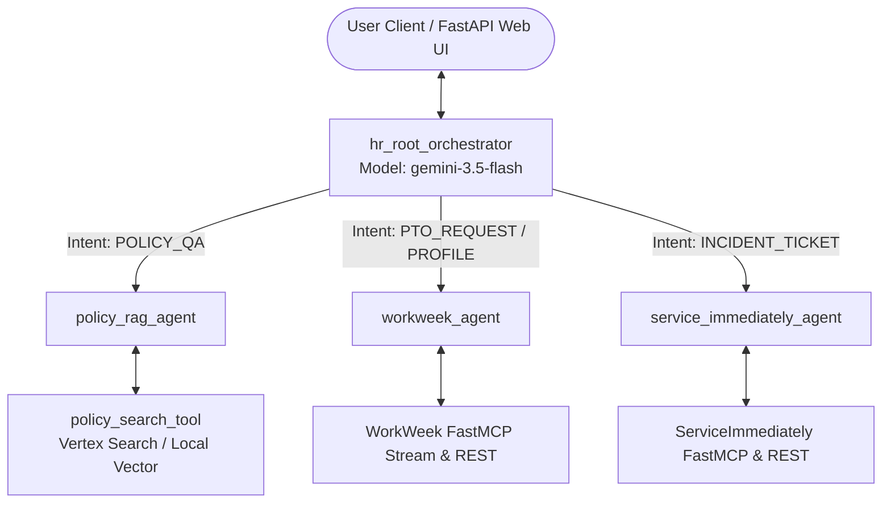

# Enterprise HR Agentic Solution (MVP 1)

[](https://cloud.google.com/vertex-ai)
[](https://deepmind.google/technologies/gemini/)
[](https://console.cloud.google.com/)
[](LICENSE)

An enterprise-grade, multi-agent HR virtual assistant platform built with the **Google Agent Development Kit (ADK)** and powered by **Gemini 3.5 Flash**. The solution provides employees with conversational self-service access to company HR policies, **WorkWeek HCM** management (PTO balance queries, leave booking, profile updates, and cancellations), and **ServiceImmediately ITSM/HRSD** helpdesk ticket operations.

The codebase is built with **zero hardcoded identifiers**, executing operations dynamically over **FastMCP Streamable HTTP** endpoints with fallback to OpenAPI REST endpoints and enforcing strict **Role-Based Access Control (RBAC)** guardrails.

---

## 📋 Table of Contents

- [Key Features](#-key-features)
- [Architecture & Topology](#-architecture--topology)
- [Project Structure](#-project-structure)
- [Sub-Agent Contracts](#-sub-agent-contracts)
- [System Parameters & Configuration](#-system-parameters--configuration)
- [Getting Started](#-getting-started)
- [Running Locally](#-running-locally)
- [Deployment](#-deployment)
- [Evaluation & Quality Benchmarks](#-evaluation--quality-benchmarks)
- [Security & Compliance](#-security--compliance)

---

## ✨ Key Features

- 🤖 **Hierarchical Multi-Agent System (MAS)**: Powered by `hr_root_orchestrator`, which dynamically routes user requests to specialized sub-agents via intent analysis and handles complex multi-step cross-system workflows.
- 📚 **Zero-Hallucination HR Policy RAG**: Grounded answers for company policies (Leave, Remote Work, Expense, Relocation) with Markdown citations.
- 🌴 **WorkWeek HCM Self-Service**: Live PTO/Sick balance lookups, leave booking with date validation, personal profile updates, and compensating rollback cancellations via FastMCP.
- 🎫 **ServiceImmediately ITSM Helpdesk**: Incident ticket status tracking, automated incident creation with critical outage guardrails, and activity log comment threads.
- 🔒 **Dynamic Identity Bridging & RBAC**: Automated resolution of authenticated user Google email to Employee ID (`EMP-xxxx`) without asking the user for credentials, while strictly denying unauthorized cross-user queries.
- 🌐 **Interactive Web UI**: Includes a web client interface simulating Google IAP authentication, PAT token generation, and real-time chat with the agent system.
- ☁️ **Production Cloud Deployment**: Automated deployment scripts for **Google Cloud Run** and **Vertex AI Agent Runtime**.

---

## 🏗️ Architecture & Topology

### System Overview

```
                                  ┌────────────────────────┐
                                  │   User / Client UI     │
                                  │ (Gemini UI / Fast API) │
                                  └───────────┬────────────┘
                                              │
                                              ▼
                                  ┌──────────────────────────┐
                                  │   hr_root_orchestrator   │
                                  │   (Gemini 3.5 Flash)     │
                                  └────────────┬─────────────┘
                                               │
         ┌────────────────────────────────────┼────────────────────────────────────┐
         │                                    │                                    │
         ▼                                    ▼                                    ▼
┌─────────────────┐                  ┌─────────────────┐                  ┌──────────────────┐
│ policy_rag_agent│                  │ workweek_agent  │                  │    itsm_agent    │
└────────┬────────┘                  └────────┬────────┘                  └────────┬─────────┘
         │                                    │                                    │
         ▼                                    ▼                                    ▼
┌──────────────────┐                 ┌──────────────────┐                 ┌──────────────────┐
│ Policy RAG Tool  │                 │ WorkWeek FastMCP │                 │ ServiceImmediate │
│ (Google RAG /    │                 │ Streamable HTTP  │                 │ FastMCP / REST   │
│  Local Vector)   │                 │ & REST API       │                 │ Endpoint         │
└──────────────────┘                 └──────────────────┘                 └──────────────────┘
```

### Multi-Agent Interaction Flow



---

## 📁 Project Structure

```
kr-elevate-module3/
├── agent/
│   ├── agent.py                 # Entrypoint exposing hr_root_orchestrator for ADK
│   ├── config.py                # Unified configuration module (GCP project, models, endpoints)
│   ├── fast_api_app.py          # FastAPI web server and UI backend
│   ├── root_orchestrator.py     # Root HR Orchestrator sub-agent router
│   ├── static/
│   │   └── index.html           # Web client UI (Google IAP simulation)
│   ├── sub_agents/
│   │   ├── policy_rag_agent.py  # Policy RAG sub-agent
│   │   ├── workweek_agent.py    # WorkWeek HCM sub-agent
│   │   └── itsm_agent.py        # ServiceImmediately ITSM sub-agent
│   └── tools/
│       ├── gcp_rag_engine.py    # Vertex AI RAG / Vector search engine loader
│       ├── rag_tool.py          # Grounded policy search tool
│       ├── workweek_mcp.py      # WorkWeek FastMCP client & REST fallback
│       └── itsm_mcp.py          # ServiceImmediately FastMCP client & REST fallback
├── evals/
│   ├── eval_config.json         # Evaluation framework configuration
│   └── datasets/
│       └── agent_test_set_1.evalset.json  # 4-Tier stratified evaluation dataset
├── resources/
│   ├── Enterprise_HR_Agentic_Solution_Design_Document_v2.md # Technical Design Spec
│   └── HR Agentic Solution BRD - Kor Trainer.md              # Business Requirements Doc
├── scripts/
│   ├── deploy_cloud_run.sh      # Cloud Run deployment automation script
│   ├── deploy_agent_runtime.sh  # Vertex AI Agent Runtime deployment script
│   └── test_policy_agent.py     # Sub-agent validation test runner
├── tests/                       # Unit and integration test suite
├── agents-cli-manifest.yaml     # ADK CLI deployment manifest
├── Dockerfile                   # Cloud Run container definition
├── pyproject.toml               # Python package and dependency configuration
└── GEMINI.md                    # Single source of truth rules and contracts
```

---

## 🤖 Sub-Agent Contracts

The solution implements four ADK agent instances adhering to standardized contracts:

| Agent Name | Sub-Agent | Model | Role & Scope | Key Tools |
| :--- | :--- | :--- | :--- | :--- |
| `hr_root_orchestrator` | Root Orchestrator | `gemini-3.5-flash` | Central intent routing, session hydration, cross-system multi-step orchestration | `transfer_to_agent` |
| `policy_rag_agent` | Policy RAG Agent | `gemini-3.5-flash` | Answers policy questions with grounded citations | `policy_search_tool` |
| `workweek_agent` | WorkWeek HCM Agent | `gemini-3.5-flash` | Manages PTO balances, leave requests, profile updates, and cancellations | `get_employee_balances_tool`, `request_time_off_tool`, `update_contact_tool`, `cancel_time_off_tool` |
| `service_immediately_agent` | ServiceImmediately ITSM Agent | `gemini-3.5-flash` | Manages IT/HRSD helpdesk tickets, incident creation, status lookups, and comments | `list_tickets_tool`, `create_ticket_tool`, `update_ticket_status_tool`, `add_ticket_comment_tool` |

---

## ⚙️ System Parameters & Configuration

All environment configurations are loaded via `agent/config.py` and strictly adhere to `GEMINI.md`:

| Parameter Key | Environment Variable | Default Value | Description |
| :--- | :--- | :--- | :--- |
| **GCP Project ID** | `GOOGLE_CLOUD_PROJECT` | `pe-kor-trainer` | Primary Google Cloud Project ID |
| **GCP Project Number** | `GOOGLE_CLOUD_PROJECT_NUMBER` | `775423734296` | Cloud Project Number |
| **GCP Region** | `GOOGLE_CLOUD_REGION` | `global` / `us-central1` | GCP Deployment Region |
| **Default Model** | `MODEL_NAME` | `gemini-3.5-flash` | Gemini LLM Model Version |
| **Embedding Model** | `EMBEDDING_MODEL` | `text-embedding-004` | 768-dim Vector Embedding Model |
| **WorkWeek MCP URL** | `WORKWEEK_MCP_URL` | `https://mock-saas.aishprabhat.demo.altostrat.com/work-week/mcp/` | WorkWeek FastMCP Endpoint |
| **ITSM MCP URL** | `ITSM_MCP_URL` | `https://mock-saas.aishprabhat.demo.altostrat.com/service-immediately/mcp/` | ServiceImmediately FastMCP Endpoint |

---

## 🚀 Getting Started

### Prerequisites

- **Python**: 3.11 or higher
- **Package Manager**: [`uv`](https://github.com/astral-sh/uv) (recommended) or `pip`
- **Google Cloud SDK**: `gcloud` CLI installed and authenticated (`gcloud auth login`)
- **GCP Credentials**: Access to project `pe-kor-trainer`

### Installation

1. **Clone the repository**:
   ```bash
   git clone https://github.com/cosmos0703/kr-elevate-module3.git
   cd kr-elevate-module3
   ```

2. **Install dependencies**:
   Using `uv`:
   ```bash
   uv sync
   ```
   Or using standard `pip`:
   ```bash
   pip install -e .
   ```

---

## 💻 Running Locally

### Option 1: FastAPI Web Application & UI

Start the local server containing the chat UI and FastMCP backend connectors:

```bash
python -m agent.fast_api_app
```
or with `uvicorn`:
```bash
uv run uvicorn agent.fast_api_app:app --host 0.0.0.0 --port 8080
```

Open your browser and navigate to **`http://localhost:8080`** to test interactive scenarios:
- **Profile & Login**: Simulate Google IAP login and view profile details.
- **PTO Management**: Query leave balances or submit time-off requests.
- **IT Support**: File IT tickets or check open incident status.

### Option 2: ADK Agents CLI Playground

Interactively test agent routing and tool execution via the ADK CLI:

```bash
agents-cli playground
```

---

## ☁️ Deployment

### 1. Google Cloud Run Deployment

Deploy the web container to Cloud Run with automated environment configuration:

```bash
chmod +x scripts/deploy_cloud_run.sh
./scripts/deploy_cloud_run.sh
```

### 2. Vertex AI Agent Runtime Deployment

Deploy the agent orchestrator to Vertex AI Agent Runtime:

```bash
chmod +x scripts/deploy_agent_runtime.sh
./scripts/deploy_agent_runtime.sh
```

---

## 📊 Evaluation & Quality Benchmarks

The project includes a 4-Tier Stratified Golden Evaluation Dataset (`evals/datasets/agent_test_set_1.evalset.json`) for automated quality verification:

| Tier | Category Weight | Focus Area | Description |
| :--- | :---: | :--- | :--- |
| **Tier 1** | `40%` | Happy Path / Lookups | PTO balance query, policy section citations, ticket lookups |
| **Tier 2** | `30%` | Cross-System Workflows | Multi-step medical leave workflow (Policy -> PTO booking -> IT ticket) |
| **Tier 3** | `15%` | Hallucination Baits | Non-existent policy probes and false premise questions |
| **Tier 4** | `15%` | Out-of-Scope Probes | Unauthorized cross-user data access and unrelated domain queries |

### Quality SLA Targets

- **Q&A Accuracy**: `>= 95%` precision (0% hallucination on policy rules)
- **Response Latency**: `< 10.0 seconds` per turn
- **Throughput**: `>= 50 QPS`

---

## 🛡️ Security & Compliance

- **Zero Hardcoded Secrets**: All authentication tokens and user credentials are resolved dynamically via FastMCP tokens (`X-MCP-Token`) and Google IAP headers.
- **RBAC Parameter Locks**: Tools strictly prevent users from querying or modifying records belonging to other employees (`ACCESS_DENIED` guardrails).
- **Prohibited Category Guardrails**: Strict policy rules blocking unapproved expense claims regardless of requested amount.
- **Critical Ticket Guardrails**: `1 - Critical` ITSM tickets require explicit outage, crash, or downtime keywords.

---

## 📄 License

This project is licensed under the Apache 2.0 License - see the [LICENSE](LICENSE) file for details.
