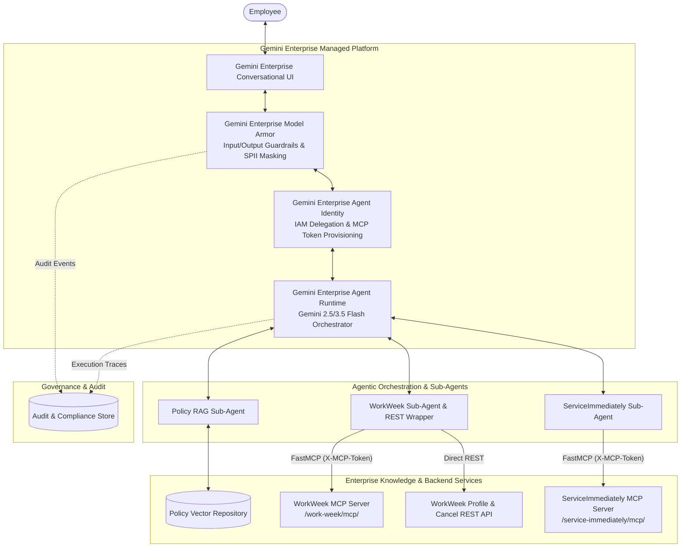
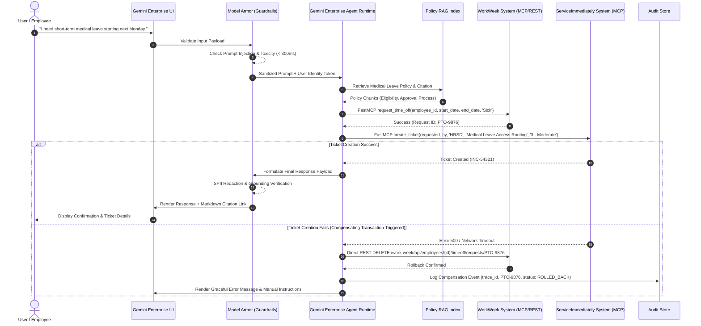

# **SOLUTION DESIGN DOCUMENT**

# **Document Control**

## **Document Metadata**

| Field | Value |
| :---- | :---- |
| Author(s) | Donguk Lee, Changjoon Kim, Inhye Park |
| Date | 2026-07-20 |
| Status | Draft |
| Target Audience | Enterprise Architecture Board, HR IT Engineering Team, Security & Governance Committee |

## **Revision History**

| Version | Date | Author | Description of Change |
| :---- | :---- | :---- | :---- |
| 0.1 | 2026-07-20 | Donguk Lee, Changjoon Kim, Inhye Park | Initial Solution Design Document draft incorporating Gemini Enterprise (Agent Runtime, Model Armor, Agent Identity, Conversational UI). |

---

# **1. Executive Summary & Scope Boundaries**

## **1.1. Business Overview & Context**

The **HR Agentic Solution (MVP 1)** is an enterprise-grade AI virtual assistant built on **Gemini Enterprise** to provide employees with automated, conversational self-service access to HR policies, employee profiles, time-off requests, and IT/HRSD helpdesk support.

### Business Challenges & Pain Points
- **High Tier-1 Ticket Volume**: HR and IT helpdesk teams spend excessive hours addressing repetitive queries regarding leave policies, benefits eligibility, and ticket status checks.
- **Fragmented User Experience**: Employees must navigate multiple disparate web portals (HCM portals, ITSM systems) to perform routine tasks like submitting vacation requests or creating IT support tickets.
- **Data Governance & Security Risks**: Unregulated AI usage poses potential risks of Sensitive Personally Identifiable Information (SPII) leaks, prompt injections, and unverified transactional execution.

### Key Business Goals
- **Deflect Tier-1 HR & IT Inquiries**: Reduce routine ticket volume by at least **40%** within 6 months.
- **Conversational Self-Service**: Automate WorkWeek (HCM) transactions (PTO balance query, leave booking, profile updates) and ServiceImmediately (ITSM) operations (ticket status check, creation, commenting).
- **Cross-System Workflow Automation**: Chain multi-step actions across policy documents, WorkWeek, and ServiceImmediately.
- **Zero-Trust Enterprise Governance**: Guarantee **100% auditability** and enforce **0% data leakage** or unauthorized cross-user data access.

---

## **1.2. Scope Boundaries**

### In-Scope (MVP 1)
- **Conversational UI**: **Gemini Enterprise Conversational UI** (web-based enterprise chat interface).
- **Agent Runtime**: **Gemini Enterprise Agent Runtime** (orchestrated via Agent Development Kit / Gemini 2.5/3.5 Flash).
- **Security & Safety Guardrails**: **Gemini Enterprise Model Armor** (real-time input/output prompt injection, jailbreak, toxicity, and SPII redaction).
- **Identity & Access Management**: **Gemini Enterprise Agent Identity** (user token delegation, scoped IAM, and RBAC).
- **Integrations**:
  - **Static HR Policy RAG Repository**: Vector search across approved HR policies (`Leave Policy`, `Expense Guidelines`, `Remote Work Policy`, `Relocation Policy`) returning grounded answers with verified citations.
  - **WorkWeek (HCM)**: FastMCP Streamable HTTP (`/work-week/mcp/`) & REST (`/work-week/api/employees/{employee_id}/profile`) for employee profiles, leave balances, contact info updates, and leave request submissions.
  - **ServiceImmediately (ITSM/HRSD)**: FastMCP (`/service-immediately/mcp/`) for incident creation, comment timelines, status updates, and duplicate prevention.
- **Use Cases**: Single-domain inquiries (UC-1.1 ~ UC-1.3) and Cross-System Orchestrations (UC-2.1 ~ UC-2.3).

### Out-of-Scope (MVP 1)
- Systems outside WorkWeek, ServiceImmediately, and designated Policy Repository.
- Multi-lingual support (English and Korean single-locale focus).
- Processing payroll data, compensation, or performance evaluations.
- Voice UI integrations.

---

## **1.3. Target Architecture Overview**

The solution leverages **Gemini Enterprise** core infrastructure components to deliver end-to-end security, runtime orchestration, and seamless user interaction.

### Core Architecture Layers
1. **Presentation Layer**: **Gemini Enterprise Conversational UI** provides an enterprise-ready, accessible, and responsive chat interface.
2. **Security & Governance Gate**: **Gemini Enterprise Model Armor** performs pre-execution input scanning (blocking direct prompt injections, jailbreaks, off-topic requests in < 300ms) and post-execution output scanning (redacting SPII like SSN, phone numbers, and addresses).
3. **Identity Layer**: **Gemini Enterprise Agent Identity** manages user identity context, token delegation (`X-MCP-Token` via `/api/mcp-tokens`), and RBAC parameter locks (`employee_id == authenticated_user_id`).
4. **Agent Runtime Layer**: **Gemini Enterprise Agent Runtime** executes the multi-agent orchestration, intent routing, temporal date resolution (`python-dateutil`), and compensating transaction handling.
5. **Backend Tool Integration Layer**: Connects statelessly to WorkWeek FastMCP/REST APIs and ServiceImmediately FastMCP tools.

---

## **1.4. Alternatives Considered**

| Technical Component | Selected Option | Alternative Considered | Rationale & Trade-offs |
| :---- | :---- | :---- | :---- |
| **Agent Runtime** | **Gemini Enterprise Agent Runtime** | Custom LangChain / AutoGen Framework | Custom frameworks require self-hosted state management, manual scaling, and custom protocol handlers. Gemini Enterprise Runtime provides managed serverless execution, native ADK integration, and SLA guarantees. |
| **Safety & Guardrails** | **Gemini Enterprise Model Armor** | Custom Regex & LLM-as-a-Judge Middleware | Custom LLM judges add 1.5s~3.0s latency. Model Armor provides optimized, sub-300ms streaming inspection for prompt injection, toxicity, and SPII redaction. |
| **Agent Identity** | **Gemini Enterprise Agent Identity** | Static Service Account Pass-through | Service accounts risk cross-tenant data leaks (FR-1.5). Gemini Enterprise Agent Identity propagates the user's IAM token to ensure scoped backend tool execution. |
| **Conversational UI** | **Gemini Enterprise Conversational UI** | Standalone Custom React Web App | Gemini Enterprise UI offers built-in accessibility, turn-key streaming, session authentication, and native integration with Model Armor. |

---

# **2. Production-Ready Future State Design**

The MVP 1 design establishes a foundation that smoothly scales into a full production platform:

1. **Enterprise SSO & IdP Federation**: Upgrade test credentials to SAML 2.0 / OIDC identity federation via Google Cloud Identity and Okta/Azure AD.
2. **Multi-Tenant System Isolation**: Extend session isolation to multi-tenant deployment models supporting corporate subsidiaries and global entities.
3. **Expanded Backend Connectors**: Integrate with additional enterprise systems (e.g., SAP SuccessFactors, Workday Payroll, Jira Enterprise) using custom MCP tools.
4. **Omnichannel Extensions**: Deploy the conversational assistant to Slack, Microsoft Teams, and mobile apps via Gemini Enterprise SDK connectors.

---

# **3. System Flows, Sequence Diagrams & Agent Design**

## **End-to-End Sequence Diagram: UC-2.2 Medical Leave Cross-System Orchestration**

The following sequence illustrates how **Gemini Enterprise** components orchestrate a multi-system workflow while handling errors and compensating transactions.

## **Agentic Structure**
- **Main HR Orchestrator Agent**: Manages state, routes user intents, validates temporal dates using `python-dateutil`, and coordinates sub-agents.
- **Policy RAG Sub-Agent**: Executes vector retrieval against HR policy indexes and applies post-retrieval entailment checks.
- **WorkWeek Sub-Agent**: Wraps FastMCP tools (`get_employee_balances`, `request_time_off`, `update_personal_info`) and REST profile calls. Auto-merges unchanged fields during contact updates.
- **ServiceImmediately Sub-Agent**: Wraps FastMCP ticket actions, enforcing duplicate prevention and ticket state machine constraints.

---

# **4. Security, Governance & Identity**

## **4.1. Gemini Enterprise Model Armor (Guardrails & Redaction)**
- **Input Guardrail**: Intercepts direct prompt injection, jailbreak attempts, and off-topic requests within a **< 300ms** latency budget (NFR-2.1).
- **Context Scanning**: Scans retrieved RAG policy chunks and downstream MCP payload responses for indirect prompt injection vectors before feeding them to the Agent Runtime.
- **Output Guardrail & SPII Redactor**: Automatically detects and redacts Sensitive Personally Identifiable Information (SSN, credit cards, personal phone numbers, home addresses) from conversational memory and log outputs (FR-1.4, FR-3.4).

## **4.2. Gemini Enterprise Agent Identity & RBAC**
- **User Delegation**: User authentication propagates via OAuth2/OIDC. Session provisioning creates ephemeral `X-MCP-Token` credentials for FastMCP calls.
- **Parameter Lock Interceptor**: Hard-codes and locks the `employee_id` parameter in all tool executions to match the authenticated caller's verified identity, preventing cross-user data access (FR-1.5).

## **4.3. Audit & Compliance Engine**
- **100% Audit Logging**: Captures `trace_id`, `session_id`, `user_id`, `automation_origin`, `tool_name`, `input_parameters`, and `execution_status` for all actions, including blocked injection attempts (FR-1.2, NFR-1.2).

---

# **5. Integration Details & Error Handling**

## **5.1. Backend Subsystem Protocols**

| Subsystem | Integration Protocol | Auth Header / Secret | Operations Supported |
| :---- | :---- | :---- | :---- |
| **WorkWeek (MCP)** | FastMCP Streamable HTTP (`/work-week/mcp/`) | `X-MCP-Token: <token>` | `get_current_employee_id()`, `get_employee_balances()`, `request_time_off()`, `update_personal_info()` |
| **WorkWeek (REST)** | REST API (`/work-week/api/`) | `x-goog-authenticated-user-email` | `GET /profile` (Profile metadata), `DELETE /timeoff/requests/{id}` (Compensating rollback) |
| **ServiceImmediately** | FastMCP Streamable HTTP (`/service-immediately/mcp/`) | `X-MCP-Token: <token>` | `list_tickets()`, `create_ticket()`, `add_ticket_comment()`, `update_ticket_status()` |
| **Policy RAG Repo** | Local Vector Search / Embeddings | N/A | Vector Similarity Search with Citation Link Verification |

## **5.2. Error Recovery & Resilience Strategies**
- **Transient Fault Tolerance (NFR-4.2)**: All outgoing HTTP and MCP tool calls are wrapped with `tenacity` retry logic using exponential backoff (initial delay 1s, max 3 retries) for 5xx errors and network timeouts.
- **Graceful Failure Handling (NFR-4.1)**: Downstream errors are sanitized by Model Armor. System stack traces are masked, and non-technical error messages are displayed to the user.
- **Compensating Transactions (NFR-4.3)**: Multi-step orchestrations implement explicit rollback handlers. If an intermediate step fails, previously completed sub-actions are automatically reverted or flagged for manual review via structured audit logs.

---

# **6. Cost Estimation & FinOps**

## **Key Cost Drivers**
1. **Gemini Enterprise Agent Runtime Token Consumption**: Primary cost factor based on input/output token volume processed by Gemini 2.5/3.5 Flash models during conversational turns and RAG context evaluation.
2. **Gemini Enterprise Model Armor Inspection Calls**: Per-turn API request cost for streaming input/output safety inspection and SPII redaction.
3. **Vector Search Index & Storage**: Monthly hosting and index search costs for HR policy embeddings.
4. **Backend Application Hosting**: Compute instance costs for running FastAPI gateways and MCP servers.

## **FinOps & Cost Optimization Strategies**
- **Prompt Optimization & Token Caching**: Cache system instructions and static policy context to minimize input token processing costs.
- **Targeted Model Selection**: Use Gemini 2.5 Flash for routine intent classification and entity extraction, reserving higher-tier reasoning for complex cross-system planning.

---

# **7. Deployment & Delivery Plan**

## **Deployment Architecture & Environments**
- **Infrastructure as Code (IaC)**: Environment provisioning via Terraform scripts ensuring identical staging and production setups.
- **Environment Separation**: Development, Staging (UAT), and Production environments with isolated database instances and configuration profiles.

## **Phased Delivery Milestones**

| Phase | Milestone Name | Key Deliverables | Target Completion |
| :---- | :---- | :---- | :---- |
| **Phase 1** | Foundation & Identity Setup | Project scaffold, `/api/mcp-tokens` provisioning, `MCPClientManager`. | Week 1 |
| **Phase 2** | Model Armor & Governance | Gemini Enterprise Model Armor integration, Input/Output safety gates, AuditLogger. | Week 2 |
| **Phase 3** | Policy RAG Subsystem | Policy Markdown ingestion pipeline, vector index, grounded citation renderer. | Week 3 |
| **Phase 4** | Subsystem Toolsets | WorkWeek FastMCP/REST wrappers, ServiceImmediately toolset with guardrails. | Week 4 |
| **Phase 5** | Agent Orchestrator & Workflows | Gemini Enterprise Agent Runtime setup, UC-1.1 ~ UC-2.3 workflow engines & rollbacks. | Week 5 |
| **Phase 6** | Conversational UI & Server Gateway | Gemini Enterprise Conversational UI integration, FastAPI chat endpoints. | Week 6 |
| **Phase 7** | UAT & Quality Evaluation | Benchmark test suite execution, security injection testing, UAT sign-off. | Week 7 |

---

# **8. Assumptions, Constraints, Risk & Mitigations**

## **8.1. Technical & Operational Assumptions**
- WorkWeek and ServiceImmediately mock servers remain accessible with standard API response contracts.
- Gemini Enterprise services (Agent Runtime, Model Armor, Agent Identity, Conversational UI) maintain standard SLAs (99.9% uptime).

## **8.2. Implementation Constraints**
- Single-tenant execution for MVP 1.
- Authentication relies on functional test credentials and mock tokens for MVP 1 delivery.

## **8.3. Risk Register & Mitigation Strategies**

| Risk Description | Severity | Impact Area | Mitigation Strategy |
| :---- | :---- | :---- | :---- |
| **Partial Workflow Failure in Multi-System Execution** | High | Data Consistency | Implement automated compensating transaction handlers (e.g. REST leave cancellation) and log structured manual recovery alerts (NFR-4.3). |
| **Indirect Prompt Injection via RAG Policy Documents** | High | Security | Enable Gemini Enterprise Model Armor Context Scanning on all vector search retrieval payloads before passing to agent context. |
| **Safety Guardrail Latency Overhead** | Medium | User Experience | Use lightweight embedding checks and regex pre-filters within Model Armor to guarantee < 300ms scanning overhead (NFR-2.1). |

---

# **9. Quality Evaluation & UAT Framework**

The solution must meet quantitative success criteria across defined evaluation benchmarks prior to production deployment:

| Evaluation Category | Metric / Benchmark | Acceptance Threshold | Evaluation Method |
| :---- | :---- | :---- | :---- |
| **Policy Q&A Accuracy** | Answer precision & groundedness | **>= 95% Accuracy** (0% hallucination) | Automated test suite over 100 benchmark policy questions. |
| **Transaction Integrity** | Execution correctness in WorkWeek/ServiceImmediately | **100% Correctness** | End-to-end integration test suites with state validation. |
| **Orchestration Success** | Cross-system workflow fulfillment (UC-2.x) | **100% Pass Rate** | Execution of synthetic scenarios (UC-2.1, UC-2.2, UC-2.3). |
| **Safety Guardrail Efficacy** | Injection/Jailbreak detection rate | **100% Block Rate** (< 1% False Positive) | Adversarial test suite with 50+ prompt injection samples. |
| **Response Latency** | Time to first token response | **< 10.0 Seconds** (Safety overhead < 300ms) | Load testing and end-to-end turn timing analysis. |
| **Audit Log Coverage** | Logged actions and safety blocks | **100% Coverage** | Audit log verification script checking `automation_origin` tags. |

---

# **10. Assumptions / Open Questions**

## **Design Assumptions & Outstanding Items**

| ID | Item Description | Status | Owner | Target Resolution Date |
| :---- | :---- | :---- | :---- | :---- |
| **AQ-01** | Confirmation of Gemini Enterprise Model Armor token rate limits for high-concurrency peak hours. | Under Review | Donguk Lee | 2026-07-25 |
| **AQ-02** | Validation of WorkWeek REST DELETE endpoint behavior when cancelling already-approved leave. | Approved | Changjoon Kim | 2026-07-22 |
| **AQ-03** | Finalization of policy document update sync frequency (FR-5.5 Document Sync Latency SLA). | Open | Inhye Park | 2026-07-27 |