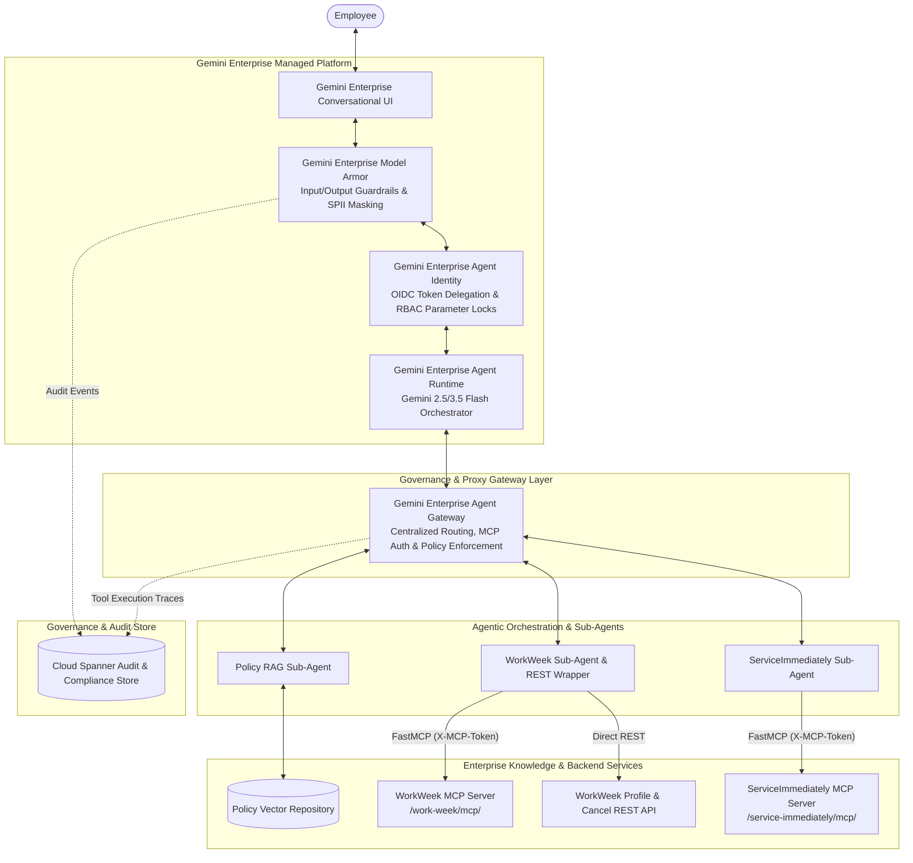
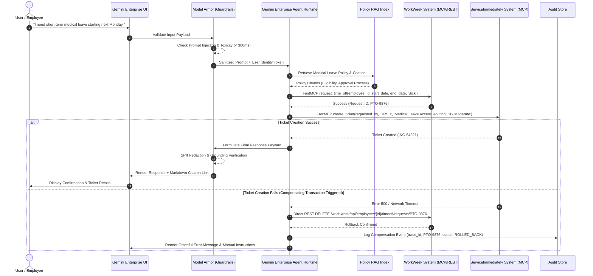

# **SOLUTION DESIGN DOCUMENT**

# **Document Control**

## **Document Metadata**

| Field | Value |
| :---- | :---- |
| Author(s) | Donguk Lee, Changjoon Kim, Inhye Park |
| Date | 2026-07-20 |
| Status | Draft |
| Target Audience | Enterprise Architecture Board, HR IT Engineering Team, Security & Governance Committee |

## **Revision History**

| Version | Date | Author | Description of Change |
| :---- | :---- | :---- | :---- |
| 0.1 | 2026-07-20 | Donguk Lee, Changjoon Kim, Inhye Park | Initial Solution Design Document draft incorporating Gemini Enterprise (Agent Runtime, Model Armor, Agent Identity, Conversational UI). |

---

# **1. Executive Summary & Scope Boundaries**

## **1.1. Business Overview & Context**

The **HR Agentic Solution (MVP 1)** is an enterprise-grade AI virtual assistant built on **Gemini Enterprise** to provide employees with automated, conversational self-service access to HR policies, employee profiles, time-off requests, and IT/HRSD helpdesk support.

### Business Challenges & Pain Points
- **High Tier-1 Ticket Volume**: HR and IT helpdesk teams spend excessive hours addressing repetitive queries regarding leave policies, benefits eligibility, and ticket status checks.
- **Fragmented User Experience**: Employees must navigate multiple disparate web portals (HCM portals, ITSM systems) to perform routine tasks like submitting vacation requests or creating IT support tickets.
- **Data Governance & Security Risks**: Unregulated AI usage poses potential risks of Sensitive Personally Identifiable Information (SPII) leaks, prompt injections, and unverified transactional execution.

### Key Business Goals
- **Deflect Tier-1 HR & IT Inquiries**: Reduce routine ticket volume by at least **40%** within 6 months (based on an estimated baseline of ~5,000 monthly Tier-1 HR/IT inquiries).
- **Conversational Self-Service**: Automate WorkWeek (HCM) transactions (PTO balance query, leave booking, profile updates) and ServiceImmediately (ITSM) operations (ticket status check, creation, commenting).
- **Cross-System Workflow Automation**: Chain multi-step actions across policy documents, WorkWeek, and ServiceImmediately.
- **Zero-Trust Enterprise Governance**: Guarantee **100% auditability** and enforce **0% data leakage** or unauthorized cross-user data access.

---

## **1.2. Scope Boundaries**

### In-Scope (MVP 1)
- **Conversational UI**: **Gemini Enterprise Conversational UI** (web-based enterprise chat interface).
- **Agent Runtime**: **Gemini Enterprise Agent Runtime** (orchestrated via Agent Development Kit / Gemini 2.5/3.5 Flash).
- **Security & Safety Guardrails**: **Gemini Enterprise Model Armor** (real-time input/output prompt injection, jailbreak, toxicity, and SPII redaction).
- **Identity & Access Management**: **Gemini Enterprise Agent Identity** (user token delegation, scoped IAM, and RBAC).
- **Integrations**:
  - **Static HR Policy RAG Repository**: Vector search across approved HR policies (`Leave Policy`, `Expense Guidelines`, `Remote Work Policy`, `Relocation Policy`) returning grounded answers with verified citations.
  - **WorkWeek (HCM)**: FastMCP Streamable HTTP (`/work-week/mcp/`) & REST (`/work-week/api/employees/{employee_id}/profile`) for employee profiles, leave balances, contact info updates, and leave request submissions.
  - **ServiceImmediately (ITSM/HRSD)**: FastMCP (`/service-immediately/mcp/`) for incident creation, comment timelines, status updates, and duplicate prevention.
- **Use Cases**: Single-domain inquiries (UC-1.1 ~ UC-1.3) and Cross-System Orchestrations (UC-2.1 ~ UC-2.3).

### Out-of-Scope (MVP 1)
- Systems outside WorkWeek, ServiceImmediately, and designated Policy Repository.
- Multi-lingual support (English and Korean single-locale focus).
- Processing payroll data, compensation, or performance evaluations.
- Voice UI integrations.

---

## **1.3. Target Architecture Overview**

The solution leverages core infrastructure components of the **Gemini Enterprise Agent Platform**, specifically integrating **Gemini Enterprise Agent Gateway**, **Agent Identity**, **Agent Runtime**, and **Model Armor** to deliver centralized governance, secure API routing, runtime orchestration, and seamless user interaction.



### Core Architecture Layers
1. **Presentation Layer**: **Gemini Enterprise Conversational UI** provides an enterprise-ready, accessible, and responsive chat interface.
2. **Security & Safety Gate**: **Gemini Enterprise Model Armor** performs pre-execution input scanning (blocking direct prompt injections, jailbreaks, off-topic requests in < 300ms) and post-execution output scanning (redacting SPII like SSN, phone numbers, and addresses).
3. **Identity Layer**: **Gemini Enterprise Agent Identity** manages user identity context, OAuth2/OIDC token delegation (`X-MCP-Token`), and RBAC parameter locks (`employee_id == authenticated_user_id`).
4. **Agent Runtime Layer**: **Gemini Enterprise Agent Runtime** executes multi-agent orchestration, intent routing, temporal date resolution (`python-dateutil`), and compensating transaction handling.
5. **Agent Gateway & Proxy Layer**: **Gemini Enterprise Agent Gateway** acts as the centralized management, security proxy, and governance hub. It enforces API rate limiting, handles protocol translation, inspects FastMCP tool calls, and routes authenticated requests statelessly between the Agent Runtime and backend subsystem tools.
6. **Backend Tool Integration Layer**: Connects statelessly to WorkWeek FastMCP/REST APIs and ServiceImmediately FastMCP tools via Agent Gateway proxying.

---

## **1.4. Alternatives Considered**

| Technical Component | Selected Option | Alternative Considered | Rationale & Trade-offs |
| :---- | :---- | :---- | :---- |
| **Agent Runtime** | **Gemini Enterprise Agent Runtime** | Custom LangChain / AutoGen Framework | Custom frameworks require self-hosted state management, manual scaling, and custom protocol handlers. Gemini Enterprise Runtime provides managed serverless execution, native ADK integration, and SLA guarantees. |
| **Safety & Guardrails** | **Gemini Enterprise Model Armor** | Custom Regex & LLM-as-a-Judge Middleware | Custom LLM judges add 1.5s~3.0s latency. Model Armor provides optimized, sub-300ms streaming inspection for prompt injection, toxicity, and SPII redaction. |
| **Agent Identity** | **Gemini Enterprise Agent Identity** | Static Service Account Pass-through | Service accounts risk cross-tenant data leaks (FR-1.5). Gemini Enterprise Agent Identity propagates the user's IAM token to ensure scoped backend tool execution. |
| **Conversational UI** | **Gemini Enterprise Conversational UI** | Standalone Custom React Web App | Gemini Enterprise UI offers built-in accessibility, turn-key streaming, session authentication, and native integration with Model Armor. |

---

# **2. Production-Ready Future State Design**

The MVP 1 design establishes a foundation that smoothly scales into a full production platform:

1. **Enterprise SSO & IdP Federation**: Upgrade test credentials to SAML 2.0 / OIDC identity federation via Google Cloud Identity and Okta/Azure AD.
2. **Multi-Tenant System Isolation**: Extend session isolation to multi-tenant deployment models supporting corporate subsidiaries and global entities.
3. **Expanded Backend Connectors**: Integrate with additional enterprise systems (e.g., SAP SuccessFactors, Workday Payroll, Jira Enterprise) using custom MCP tools.
4. **Omnichannel Extensions**: Deploy the conversational assistant to Slack, Microsoft Teams, and mobile apps via Gemini Enterprise SDK connectors.

---

# **3. System Flows, Sequence Diagrams & Agent Design**

## **End-to-End Sequence Diagram: UC-2.2 Medical Leave Cross-System Orchestration**

The following sequence illustrates how **Gemini Enterprise** components orchestrate a multi-system workflow while handling errors and compensating transactions.



## **Agentic Structure**
- **Main HR Orchestrator Agent**: Manages state, routes user intents, validates temporal dates using `python-dateutil`, and coordinates sub-agents.
- **Policy RAG Sub-Agent**: Executes vector retrieval against HR policy indexes and applies post-retrieval entailment checks.
- **WorkWeek Sub-Agent**: Wraps FastMCP tools (`get_employee_balances`, `request_time_off`, `update_personal_info`) and REST profile calls. Auto-merges unchanged fields during contact updates.
- **ServiceImmediately Sub-Agent**: Wraps FastMCP ticket actions, enforcing duplicate prevention and ticket state machine constraints.

## **3.3. Asynchronous Processing & Long-Running Tasks**

For long-running background actions (e.g., bulk leave entitlement updates, asynchronous HRSD escalation workflows, or multi-document policy ingestion jobs):
- **Decoupled Messaging & Queueing**: Long-running requests are published as event payloads to **Google Cloud Pub/Sub** topics.
- **Task Scheduling & Retries**: **Google Cloud Tasks** dispatches asynchronous jobs to dedicated background worker instances with exponential retry policies, dead-letter queues (DLQ), and execution timeouts (max 30 mins).
- **Callback State Notification**: Upon task completion, workers update session state via the Session Hydration Store and publish progress notifications back to the Gemini Enterprise Conversational UI via WebSocket/SSE event push.

---

# **4. Security, Governance & Identity**

## **4.1. Gemini Enterprise Model Armor (Guardrails & Redaction)**
- **Input Guardrail**: Intercepts direct prompt injection, jailbreak attempts, and off-topic requests within a **< 300ms** latency budget (NFR-2.1).
- **Context Scanning**: Scans retrieved RAG policy chunks and downstream MCP payload responses for indirect prompt injection vectors before feeding them to the Agent Runtime.
- **Output Guardrail & SPII Redactor**: Automatically detects and redacts Sensitive Personally Identifiable Information (SSN, credit cards, personal phone numbers, home addresses) from conversational memory and log outputs (FR-1.4, FR-3.4).

## **4.2. Gemini Enterprise Agent Identity & Agent Gateway Governance**
- **User Identity Delegation**: User authentication propagates seamlessly via OAuth2/OIDC. Session provisioning creates ephemeral `X-MCP-Token` credentials passed through **Gemini Enterprise Agent Gateway** for backend FastMCP tool authorization.
- **Parameter Lock Interceptor**: Hard-codes and locks the `employee_id` parameter in all tool executions to match the authenticated caller's verified IAM identity, preventing cross-user data access (FR-1.5).
- **Gateway Policy Enforcement**: Agent Gateway monitors tool execution frequency, enforces per-user rate limits, logs trace telemetry, and validates tool parameters prior to backend execution.

## **4.3. Multi-Role RBAC Permissions Matrix**

| Role Name | Policy RAG Query | View Own Profile/PTO | Submit Own PTO Request | Update Personal Info | View Team Profiles | Create/Update IT Tickets | Access Audit Logs |
| :--- | :---: | :---: | :---: | :---: | :---: | :---: | :---: |
| **Employee (Standard)** | ✅ Allowed | ✅ Allowed | ✅ Allowed | ✅ Allowed | ❌ Denied | ✅ Allowed | ❌ Denied |
| **HR Specialist / Manager** | ✅ Allowed | ✅ Allowed | ✅ Allowed | ✅ Allowed | ✅ Allowed | ✅ Allowed | ❌ Denied |
| **IT Helpdesk Analyst** | ✅ Allowed | ✅ Allowed | ❌ Denied | ❌ Denied | ❌ Denied | ✅ Full Access | ❌ Denied |
| **Security & Compliance Auditor** | ✅ Allowed | ❌ Denied | ❌ Denied | ❌ Denied | ❌ Denied | ❌ Denied | ✅ Full Read-Only |

## **4.4. Data Protection, Secrets Vaulting & Encryption**
- **Secrets Vaulting**: Sensitive API credentials, private certificates, and FastMCP tokens are managed securely in **Google Secret Manager** with automatic rotation and IAM access controls.
- **Encryption-in-Transit**: All internal and external network communication is enforced via TLS 1.3 with strict cipher suites.
- **Encryption-at-Rest**: All persistent storage layers (Firestore, Cloud Spanner, Vector Search index, and Cloud Storage buckets) are encrypted using Customer-Managed Encryption Keys (**CMEK**) backed by **Google Cloud KMS** (AES-256).

## **4.5. Audit & Compliance Engine & Lifecycle Management**

### **4.5.1. Audit Database Engine & Relational Schema**
Operational audit logs are stored in **Google Cloud Spanner** (multi-region, ACID-compliant transactional store) for real-time compliance tracking.

```sql
CREATE TABLE audit_logs (
    log_id STRING(36) NOT NULL,
    trace_id STRING(64) NOT NULL,
    session_id STRING(64) NOT NULL,
    user_id STRING(64) NOT NULL,
    timestamp TIMESTAMP NOT NULL OPTIONS (allow_commit_timestamp = true),
    automation_origin STRING(32) NOT NULL, -- 'USER_CHAT', 'AGENT_ORCHESTRATOR', 'SUB_AGENT'
    tool_name STRING(64),
    input_parameters_json JSON,
    execution_status STRING(32) NOT NULL, -- 'SUCCESS', 'BLOCKED_BY_GUARDRAIL', 'SYSTEM_ERROR', 'ROLLED_BACK'
    spii_redacted_count INT64 NOT NULL DEFAULT (0),
    model_armor_verdict STRING(32)
) PRIMARY KEY (log_id);
```

### **4.5.2. Audit Data Retention & Archiving Policy**
- **Active Hot Tier (90 Days)**: Audit records remain in **Cloud Spanner** for 90 days to support real-time compliance dashboards, security investigations, and active operational tracing.
- **Cold Storage Archive (7 Years)**: Automated nightly export jobs transfer audit records older than 90 days to **Google Cloud Storage (Coldline/Archive Class)** and **BigQuery** for long-term historical analysis and regulatory compliance (7-year mandatory enterprise retention policy).

---

# **5. Integration Details & Error Handling**

## **5.1. Backend Subsystem Protocols**

| Subsystem | Integration Protocol | Auth Header / Secret | Operations Supported |
| :---- | :---- | :---- | :---- |
| **WorkWeek (MCP)** | FastMCP Streamable HTTP (`/work-week/mcp/`) | `X-MCP-Token: <token>` | `get_current_employee_id()`, `get_employee_balances()`, `request_time_off()`, `update_personal_info()` |
| **WorkWeek (REST)** | REST API (`/work-week/api/`) | `x-goog-authenticated-user-email` | `GET /profile` (Profile metadata), `DELETE /timeoff/requests/{id}` (Compensating rollback) |
| **ServiceImmediately** | FastMCP Streamable HTTP (`/service-immediately/mcp/`) | `X-MCP-Token: <token>` | `list_tickets()`, `create_ticket()`, `add_ticket_comment()`, `update_ticket_status()` |
| **Policy RAG Repo** | Local Vector Search / Embeddings | N/A | Vector Similarity Search with Citation Link Verification |

## **5.2. Data Model & FastMCP API Payload Specifications**

### **5.2.1. FastMCP Tool Contracts**

#### **WorkWeek `request_time_off` JSON Schema**
```json
{
  "name": "request_time_off",
  "description": "Submits a new PTO or sick leave request in WorkWeek",
  "parameters": {
    "type": "object",
    "properties": {
      "employee_id": { "type": "string", "description": "Authenticated Employee ID (locked via Agent Identity)" },
      "start_date": { "type": "string", "format": "date", "description": "Leave start date (YYYY-MM-DD)" },
      "end_date": { "type": "string", "format": "date", "description": "Leave end date (YYYY-MM-DD)" },
      "leave_type": { "type": "string", "enum": ["Vacation", "Sick", "Personal", "Parental"], "description": "Type of leave" }
    },
    "required": ["employee_id", "start_date", "end_date", "leave_type"]
  }
}
```

#### **ServiceImmediately `create_ticket` JSON Schema**
```json
{
  "name": "create_ticket",
  "description": "Creates an incident or support ticket in ServiceImmediately",
  "parameters": {
    "type": "object",
    "properties": {
      "requested_by": { "type": "string", "description": "Employee ID or email of requester" },
      "category": { "type": "string", "enum": ["HRSD", "IT_Support", "Facilities"], "description": "Ticket domain category" },
      "short_description": { "type": "string", "description": "Brief summary of the inquiry or issue" },
      "priority": { "type": "string", "enum": ["1 - Critical", "2 - High", "3 - Moderate", "4 - Low"], "default": "3 - Moderate" }
    },
    "required": ["requested_by", "category", "short_description"]
  }
}
```

### **5.2.2. Policy Vector Index Chunk Metadata Schema**
```json
{
  "doc_id": "hr-policy-leave-2026",
  "title": "Enterprise Annual & Medical Leave Policy",
  "chunk_id": "chunk_sec3_para2",
  "section_header": "3.1 Medical & Short-Term Disability Leave",
  "content": "Employees are eligible for up to 10 consecutive business days of paid medical leave upon submitting...",
  "source_file": "resources/policies/Leave_Policy.md",
  "effective_date": "2026-01-01",
  "vector_dimensions": 768
}
```

## **5.3. Conversational State Management & Session Hydration**
- **Primary Storage Engine**: Conversational history and multi-turn slot state are persisted in **Google Cloud Firestore** (NoSQL document store) with low-latency document reads.
- **In-Memory Session Cache**: **Cloud Memorystore (Redis)** acts as an in-memory caching tier to achieve sub-15ms session state hydration during active conversational turns.
- **Hydration & Pruning Lifecycle**:
  1. **Turn Hydration**: Upon receiving a user message, the Agent Runtime hydrates the last $N=10$ conversation turns, user context, and active intent state from Redis into memory.
  2. **Context Window Optimization**: Older turns are summarized into compact semantic memory to prevent prompt context bloat.
  3. **Turn Persistence**: Once the final turn response is emitted and Model Armor SPII redaction completes, updated state is asynchronously committed back to Redis and Firestore.

## **5.4. Error Recovery & Resilience Strategies**

- **Transient Fault Tolerance (NFR-4.2)**: All outgoing HTTP and MCP tool calls are wrapped with `tenacity` retry logic using exponential backoff (initial delay 1s, max 3 retries) for 5xx errors and network timeouts.
- **Graceful Failure Handling (NFR-4.1)**: Downstream errors are sanitized by Model Armor. System stack traces are masked, and non-technical error messages are displayed to the user.
- **Compensating Transactions (NFR-4.3)**: Multi-step orchestrations implement explicit rollback handlers. If an intermediate step fails, previously completed sub-actions are automatically reverted or flagged for manual review via structured audit logs.

### **Structured Error Handling Matrix**

| Failure Scenario | Technical Root Cause | Automatic System Fallback Action | User-Facing Error Message |
| :--- | :--- | :--- | :--- |
| **Model Armor SPII Block** | User input or model output contains unmasked Sensitive PII | Intercept payload; redact SPII or abort turn if malicious | *"For your protection, sensitive personal data was detected and masked. Please verify your input."* |
| **WorkWeek FastMCP 500 Error** | WorkWeek API service temporary outage or 5xx response | Apply exponential retry (3x via `tenacity`); fallback to cached profile if read-only | *"We are currently unable to connect to WorkWeek. Your request has been logged and will be retried shortly."* |
| **ServiceImmediately Timeout** | Network timeout during ticket creation (> 5.0s) | Trigger compensating transaction (cancel booked leave in WorkWeek via REST); log audit alert | *"Unable to finalize your IT ticket. Your time-off booking has been automatically reverted to maintain consistency."* |
| **Vector DB Unreachable** | Policy RAG vector index node connection failure | Fallback to keyword-based search index; append disclaiming citation note | *"Unable to perform vector policy lookup. Providing answer from fallback policy index."* |
| **Rate Limit Exceeded** | Agent Gateway user rate limit exceeded (> 30 requests/min) | Return HTTP 429 via Agent Gateway; enforce client backoff header | *"You have sent too many requests in a short time. Please wait a moment before asking again."* |

---

# **6. Cost Estimation & FinOps**

## **6.1. Key Cost Drivers**
1. **Gemini Enterprise Agent Runtime Token Consumption**: Primary cost factor based on input/output token volume processed by Gemini 2.5/3.5 Flash models during conversational turns and RAG context evaluation.
2. **Gemini Enterprise Model Armor Inspection Calls**: Per-turn API request cost for streaming input/output safety inspection and SPII redaction.
3. **Vector Search Index & Storage**: Monthly hosting and index search costs for HR policy embeddings.
4. **Backend Application Hosting**: Compute instance costs for running FastAPI gateways, Agent Gateway proxies, and FastMCP servers.

## **6.2. Quantitative Cost Estimates & Scaling Cost Model**

*Baseline Volume Assumption: 5,000 monthly inquiries (~15,000 conversational turns total).*

| Cost Component | Pricing Unit / Rate | Monthly Consumption Estimate | Estimated Monthly Cost (USD) |
| :--- | :--- | :--- | :---: |
| **Gemini 2.5 Flash Tokens** | $0.075 / 1M Input Tokens<br/>$0.30 / 1M Output Tokens | 45M Input Tokens<br/>7.5M Output Tokens | $3.38<br/>$2.25 |
| **Model Armor Safety Inspection** | $0.10 / 1,000 streaming API requests | 15,000 turns × 2 (in/out) = 30,000 calls | $3.00 |
| **Vector Search Index Hosting** | Standard Vector Search Endpoint ($0.07/hr) | 730 hours/month | $51.10 |
| **Cloud Spanner & Storage Audit** | Spanner 0.1 Processing Unit + GCS Archive | 90 days active DB + GCS Coldline | $45.00 |
| **Cloud Run & FastAPI Gateways** | 2 vCPU / 4GB RAM autoscale (0 to 5 nodes) | ~100 compute hours active | $25.00 |
| **Estimated Total Monthly Cost** | | **5,000 Inquiries Baseline** | **~$129.73 / month** |

*Scaling Projection: Scaling to 50,000 inquiries/month (~150,000 turns) scales linearly to approximately **~$850.00 / month**, demonstrating high cost-efficiency (cost per ticket deflection < $0.05).*

## **6.3. FinOps & Cost Optimization Strategies**
- **Prompt Optimization & Token Caching**: Cache system instructions and static policy context to minimize input token processing costs by up to 50%.
- **Targeted Model Selection**: Use Gemini 2.5 Flash for routine intent classification and entity extraction, reserving higher-tier reasoning for complex cross-system planning.

---

# **7. Deployment & Delivery Plan**

## **7.1. Deployment Architecture & Environments**
- **Infrastructure as Code (IaC)**: Environment provisioning via Terraform scripts ensuring identical staging and production setups.
- **Environment Separation**: Development, Staging (UAT), and Production environments with isolated database instances and configuration profiles.

## **7.2. Automated CI/CD Pipeline**

The deployment pipeline is automated via **GitHub Actions** and **Google Cloud Build**, enforcing rigorous quality gates before promotion:

```
[Code Push / PR] ──→ [1. Lint & Static Analysis] ──→ [2. Unit & MCP Contract Tests]
                                                                  │
[Production Deploy] ◄── [5. Terraform Apply] ◄── [4. Security Scan] ◄── [3. Model Armor Test]
```

1. **Lint & Static Code Analysis**: Runs `ruff`, `mypy`, and `markdownlint` to ensure code formatting and type safety.
2. **Unit & FastMCP Contract Testing**: Executes `pytest` suites against mock WorkWeek and ServiceImmediately MCP servers to validate schema compliance.
3. **Model Armor Adversarial Scan**: Runs automated adversarial prompt injection test suites (50+ attack samples) to verify guardrail block rates.
4. **Terraform Security & IaC Validation**: Scans Terraform configuration files using `tfsec` and `checkov` before running `terraform plan`.
5. **Automated Promotion & Deployment**: Applies Terraform IaC to Staging/UAT automatically upon merge to `main`, requiring manual approval gate for Production deployment.

## **7.3. Phased Delivery Milestones**

| Phase | Milestone Name | Key Deliverables | Target Completion | Resource Allocation (Roles & Estimated FTE) |
| :---- | :---- | :---- | :---- | :---- |
| **Phase 1** | Foundation & Identity Setup | Project scaffold, `/api/mcp-tokens` provisioning, `MCPClientManager`. | Week 1 | 1 Lead Architect, 1 Identity/Backend Engineer (1.5 FTE) |
| **Phase 2** | Model Armor & Governance | Gemini Enterprise Model Armor integration, Input/Output safety gates, AuditLogger. | Week 2 | 1 Security Engineer, 1 AI/Safety Engineer (1.5 FTE) |
| **Phase 3** | Policy RAG Subsystem | Policy Markdown ingestion pipeline, vector index, grounded citation renderer. | Week 3 | 1 RAG/Data Engineer, 1 Integration Engineer (1.5 FTE) |
| **Phase 4** | Subsystem Toolsets | WorkWeek FastMCP/REST wrappers, ServiceImmediately toolset with guardrails. | Week 4 | 2 Integration Engineers (2.0 FTE) |
| **Phase 5** | Agent Orchestrator & Workflows | Gemini Enterprise Agent Runtime setup, UC-1.1 ~ UC-2.3 workflow engines & rollbacks. | Week 5 | 1 Lead Architect, 2 Agent Engineers (2.5 FTE) |
| **Phase 6** | Conversational UI & Server Gateway | Gemini Enterprise Conversational UI integration, FastAPI chat endpoints. | Week 6 | 1 Frontend Engineer, 1 Gateway Engineer (2.0 FTE) |
| **Phase 7** | UAT & Quality Evaluation | Benchmark test suite execution, security injection testing, UAT sign-off. | Week 7 | 1 QA Lead, 1 Security Auditor, 1 Integration Engineer (2.5 FTE) |

---

# **8. Assumptions, Constraints, Risk & Mitigations**

## **8.1. Technical & Operational Assumptions**
- WorkWeek and ServiceImmediately mock servers remain accessible with standard API response contracts.
- Gemini Enterprise services (Agent Runtime, Model Armor, Agent Identity, Conversational UI) maintain standard SLAs (99.9% uptime).

## **8.2. Implementation Constraints**
- Single-tenant execution for MVP 1.
- Authentication relies on functional test credentials and mock tokens for MVP 1 delivery.

## **8.3. Risk Register & Mitigation Strategies**

| Risk Description | Severity | Impact Area | Mitigation Strategy |
| :---- | :---- | :---- | :---- |
| **Partial Workflow Failure in Multi-System Execution** | High | Data Consistency | Implement automated compensating transaction handlers (e.g. REST leave cancellation) and log structured manual recovery alerts (NFR-4.3). |
| **Indirect Prompt Injection via RAG Policy Documents** | High | Security | Enable Gemini Enterprise Model Armor Context Scanning on all vector search retrieval payloads before passing to agent context. |
| **Safety Guardrail Latency Overhead** | Medium | User Experience | Use lightweight embedding checks and regex pre-filters within Model Armor to guarantee < 300ms scanning overhead (NFR-2.1). |

---

# **9. Quality Evaluation & UAT Framework**

The solution must meet quantitative success criteria across defined evaluation benchmarks prior to production deployment:

| Evaluation Category | Metric / Benchmark | Acceptance Threshold | Evaluation Method |
| :---- | :---- | :---- | :---- |
| **Policy Q&A Accuracy** | Answer precision & groundedness | **>= 95% Accuracy** (0% hallucination) | Automated test suite over 100 benchmark policy questions. |
| **Transaction Integrity** | Execution correctness in WorkWeek/ServiceImmediately | **100% Correctness** | End-to-end integration test suites with state validation. |
| **Orchestration Success** | Cross-System workflow fulfillment (UC-2.x) | **100% Pass Rate** | Execution of synthetic scenarios (UC-2.1, UC-2.2, UC-2.3). |
| **Safety Guardrail Efficacy** | Injection/Jailbreak detection rate | **100% Block Rate** (< 1% False Positive) | Adversarial test suite with 50+ prompt injection samples. |
| **Response Latency** | Time to first token response | **< 10.0 Seconds** (Safety overhead < 300ms) | Load testing and end-to-end turn timing analysis. |
| **System Throughput** | Peak Chat Concurrency & Throughput | **>= 50 QPS** (Max 500 concurrent active chat sessions) | Load testing on FastAPI Gateway and MCP Wrappers. |
| **Service Availability** | Gateway & System SLA Uptime | **99.9% Uptime** (excluding upstream vendor maintenance) | Synthetic heartbeat probes & Cloud Monitoring dashboard. |
| **Audit Log Coverage** | Logged actions and safety blocks | **100% Coverage** | Audit log verification script checking `automation_origin` tags. |

---

# **10. Assumptions / Open Questions**

## **Design Assumptions & Outstanding Items**

| ID | Item Description | Status | Owner | Target Resolution Date |
| :---- | :---- | :---- | :---- | :---- |
| **AQ-01** | Confirmation of Gemini Enterprise Model Armor token rate limits for high-concurrency peak hours. | Under Review | Donguk Lee | 2026-07-25 |
| **AQ-02** | Validation of WorkWeek REST DELETE endpoint behavior when cancelling already-approved leave. | Approved | Changjoon Kim | 2026-07-22 |
| **AQ-03** | Finalization of policy document update sync frequency (FR-5.5 Document Sync Latency SLA). | Open | Inhye Park | 2026-07-27 |

---

# **11. Appendix: Business Stakeholder AI Glossary & Executive Guide**

To assist HR Leadership, Business Stakeholders, and non-technical reviewers, this section translates specialized technical and AI concepts into clear business terms and analogies.

| Specialized AI / Technical Term | Non-Technical Business Definition | Real-World Business Analogy |
| :--- | :--- | :--- |
| **Gemini Enterprise Agent Gateway** | A centralized digital receptionist and security guard that safely routes user requests to HR & IT systems. | **Security Desk & Receptionist**: Checks your ID badge, verifies what rooms you are allowed to enter, and guides you to the right department. |
| **Gemini Enterprise Model Armor** | A real-time safety and privacy filter that screens incoming messages and redacts private employee data. | **Confidentiality Shredder & Scanner**: Automatically blacks out Sensitive PII (like SSNs) on documents before anyone else can view them. |
| **Gemini Enterprise Agent Identity** | A secure identity delegation mechanism ensuring the AI only performs actions the logged-in user is authorized to do. | **Digital ID Badge & Delegated Pass**: Ensures the AI can only access *your* PTO balance, never another colleague's profile. |
| **FastMCP (Model Context Protocol)** | A standardized software plug that allows the AI agent to interact directly with systems like WorkWeek and ServiceImmediately. | **Universal Travel Adaptor**: Enables different devices and power outlets from different countries to connect effortlessly. |
| **RAG (Retrieval-Augmented Generation)** | A technique where the AI reads official, approved HR policy documents to generate factual answers with citations. | **Open-Book Exam**: Instead of guessing from memory, the assistant opens the exact HR policy handbook and quotes the specific page. |
| **Prompt Injection Guardrail** | An anti-tamper security layer that blocks attempts to trick the AI into ignoring company rules or leaking data. | **Fraud Detection System**: Detects sneaky or deceptive language designed to trick customer service into giving unauthorized discounts. |
| **Compensating Transaction** | An automatic safety feature that undoes a previous step if a multi-step request fails halfway through. | **Automatic Eraser / Transaction Undo**: If ordering a laptop succeeds but shipping label creation fails, the laptop order is automatically cancelled so no ghost orders remain. |