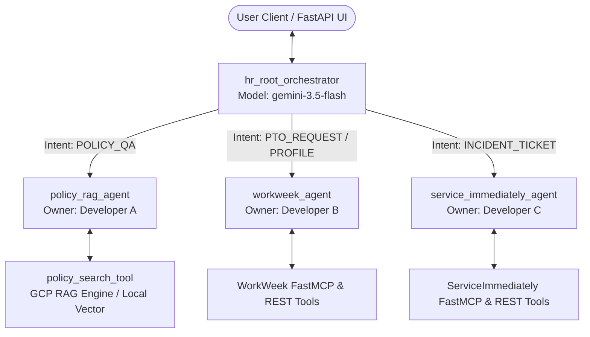

# **ENTERPRISE HR AGENTIC SOLUTION - TECHNICAL DESIGN DOCUMENT (v2.0)**

# **Document Control**

## **Document Metadata**

| Field | Value |
| :---- | :---- |
| **Title** | Enterprise HR Agentic Solution (MVP 1) - Production Architecture & Design Specification |
| **Author(s)** | Inhye Park, Donguk Lee, Changjoon Kim |
| **Date** | 2026-07-23 |
| **Version** | 2.0 (Production-Ready Codebase State) |
| **Status** | Approved / Implemented |
| **GCP Project** | `pe-kor-trainer` (Project Number: `775423734296`, Region: `global` / `us-central1`) |
| **Target Model** | `gemini-3.5-flash` |
| **Target Audience** | Enterprise Architects, Engineering Teams, DevOps/SRE, Security & Compliance Auditors |

## **Revision History**

| Version | Date | Author | Description of Change |
| :---- | :---- | :---- | :---- |
| 1.0 | 2026-07-20 | Joint Team | Initial conceptual design document for HR Agentic Solution. |
| 2.0 | 2026-07-23 | Inhye Park, Joint Team | Updated design document reflecting zero-hardcoding FastMCP streamable HTTP integration, dynamic identity bridging, Cloud Run & Agent Runtime deployment scripts, and 4-tier evaluation suite. |

---

# **1. Executive Summary & Core Objectives**

## **1.1. System Overview**

The **Enterprise HR Agentic Solution (MVP 1)** is a multi-agent HR virtual assistant platform built on the **Google Agent Development Kit (ADK)** and powered by **Gemini 3.5 Flash**. It provides employees with seamless, conversational self-service access to HR policies, WorkWeek HCM management (PTO balance queries, leave booking, personal profile updates), and ServiceImmediately ITSM/HRSD helpdesk ticket operations.

The production codebase is fully implemented with **zero hardcoding**, executing operations dynamically over **FastMCP Streamable HTTP** endpoints with automatic failover to OpenAPI REST endpoints.

```
                                  ┌────────────────────────┐
                                  │   User / Client UI     │
                                  │ (Gemini UI / Fast API) │
                                  └───────────┬────────────┘
                                              │
                                              ▼
                                 ┌──────────────────────────┐
                                 │   hr_root_orchestrator   │
                                 │   (Gemini 3.5 Flash)     │
                                 └────────────┬─────────────┘
                                              │
         ┌────────────────────────────────────┼────────────────────────────────────┐
         │                                    │                                    │
         ▼                                    ▼                                    ▼
┌─────────────────┐                  ┌─────────────────┐                  ┌──────────────────┐
│ policy_rag_agent│                  │ workweek_agent  │                  │    itsm_agent    │
└────────┬────────┘                  └────────┬────────┘                  └────────┬─────────┘
         │                                    │                                    │
         ▼                                    ▼                                    ▼
┌──────────────────┐                 ┌──────────────────┐                 ┌──────────────────┐
│ Policy RAG Tool  │                 │ WorkWeek FastMCP │                 │ ServiceImmediate │
│ (Google RAG /    │                 │ Streamable HTTP  │                 │ FastMCP / REST   │
│  Local Vector)   │                 │ & REST API       │                 │ Endpoint         │
└──────────────────┘└──────────────────┘                 └──────────────────┘
```

## **1.2. Strategic Business Goals & SLA Metrics**

- **Tier-1 Helpdesk Deflection**: Deflect >= 40% of routine HR and IT helpdesk queries.
- **Zero Hallucination Grounding**: 100% policy responses grounded in official HR policy documentation with document and section citations.
- **Dynamic Identity Bridging**: Automatic resolution of authenticated user Google email (`user@google.com`) to Employee ID (`EMP-xxxx`) without prompting the user.
- **Target Latency**: Overhead < 10.0 seconds per conversation turn.
- **Accuracy Target**: >= 95% precision across multi-turn and cross-system workflows.

---

# **2. Unified Project Infrastructure Parameters**

All components, scripts, and environment loaders strictly enforce the following standardized parameter configuration across environments:

| Parameter Key | Environment Variable | Standard Value | Description |
| :--- | :--- | :--- | :--- |
| **GCP Project ID** | `GOOGLE_CLOUD_PROJECT` | `pe-kor-trainer` | Primary Google Cloud Project ID |
| **GCP Project Number** | `GOOGLE_CLOUD_PROJECT_NUMBER` | `775423734296` | Numeric Cloud Project Identifier |
| **GCP Region** | `GOOGLE_CLOUD_REGION` | `global` / `us-central1` | Deployment Region |
| **Default LLM Model** | `MODEL_NAME` | `gemini-3.5-flash` | Primary Foundation Model |
| **Vector Embedding Model**| `EMBEDDING_MODEL` | `text-embedding-004` | 768-dimensional Vector Embeddings |
| **WorkWeek MCP URL** | `WORKWEEK_MCP_URL` | `https://mock-saas.aishprabhat.demo.altostrat.com/work-week/mcp/` | FastMCP Streamable HTTP Endpoint |
| **WorkWeek REST URL** | `WORKWEEK_REST_URL` | `https://mock-saas.aishprabhat.demo.altostrat.com/work-week/api` | OpenAPI REST Base Endpoint |
| **ServiceImmediately MCP** | `ITSM_MCP_URL` | `https://mock-saas.aishprabhat.demo.altostrat.com/service-immediately/mcp/` | FastMCP Streamable HTTP Endpoint |

---

# **3. Multi-Agent Topology & Sub-Agent Contracts**

The system employs a hierarchical Multi-Agent System (MAS) architecture governed by `hr_root_orchestrator`.



## **3.1. Sub-Agent Declarations & Contracts**

### 1. Root HR Orchestrator (`hr_root_orchestrator`)
- **Variable**: `hr_root_orchestrator`
- **Name**: `hr_root_orchestrator`
- **Model**: `gemini-3.5-flash`
- **Description**: `"Main HR Orchestrator routing user intents and executing cross-system multi-step workflows."`
- **Responsibility**: Inspects incoming intent, maintains session context, enforces identity locks via `before_agent_callback`, and delegates to sub-agents via `transfer_to_agent`. Supports multi-step workflows (e.g. Policy QA -> Leave Booking -> IT Ticket creation).

### 2. Policy RAG Sub-Agent (`policy_rag_agent`)
- **Variable**: `policy_rag_agent`
- **Name**: `policy_rag_agent`
- **Model**: `gemini-3.5-flash`
- **Description**: `"Answers employee questions about company HR policies (Leave, Remote Work, Expense, Relocation) with grounded citations."`
- **Tools**: `policy_search_tool`
- **Instruction Rules**: Strict grounding in retrieved policy context; refusal notice if policy not found; prohibition category overrides (e.g. room salon entertainment strictly prohibited regardless of cost threshold); verified markdown source citations.

### 3. WorkWeek HCM Sub-Agent (`workweek_agent`)
- **Variable**: `workweek_agent`
- **Name**: `workweek_agent`
- **Model**: `gemini-3.5-flash`
- **Description**: `"Handles WorkWeek HCM transactions: PTO balances, personal contact updates, and leave booking."`
- **Tools**: `get_current_employee_id_tool`, `get_employee_balances_tool`, `request_time_off_tool`, `update_contact_tool`, `get_leave_requests_history_tool`, `cancel_time_off_tool`, `get_employee_feedback_tool`.
- **Instruction Rules**: Identity bridging via user session state; RBAC parameter locks preventing cross-user data access.

### 4. ServiceImmediately ITSM Sub-Agent (`itsm_agent`)
- **Variable**: `itsm_agent`
- **Name**: `service_immediately_agent`
- **Model**: `gemini-3.5-flash`
- **Description**: `"Handles ServiceImmediately ITSM operations: ticket status queries, incident creation, and comments."`
- **Tools**: `list_tickets_tool`, `create_ticket_tool`, `update_ticket_status_tool`, `add_ticket_comment_tool`.
- **Instruction Rules**: FastMCP streamable connection with REST fallback; priority guardrails (critical tickets require outage keywords); duplicate ticket prevention.

---

# **4. Backend Protocols, Auth Headers & Zero-Hardcoding Integration**

## **4.1. FastMCP Streamable HTTP & REST Integration Protocol**

All backend SaaS operations connect dynamically to remote endpoints.

```
┌─────────────────────────────────────────────────────────────────────────────┐
│                           Tool Execution Pipeline                            │
└─────────────────────────────────────────────────────────────────────────────┘
                                       │
                                       ▼
                     ┌───────────────────────────────────┐
                     │ FastMCP Streamable HTTP Client    │
                     │ (mcp.client.streamable_http)      │
                     │ Headers:                          │
                     │ - cookie: LIVE_IAP_COOKIE         │
                     │ - X-MCP-Token: <ephemeral_token>  │
                     └─────────────────┬─────────────────┘
                                       │
                         ┌─────────────┴─────────────┐
                         │                           │
                   (Status == 200)             (Error / Fallback)
                         │                           │
                         ▼                           ▼
               ┌───────────────────┐       ┌────────────────────┐
               │ FastMCP Tool Call │       │ OpenAPI REST       │
               │ Execution         │       │ Fallback Execution │
               └───────────────────┘       └────────────────────┘
```

### Authentication Header Matrix

| Subsystem | Protocol | Base URL | Required Auth Headers |
| :--- | :--- | :--- | :--- |
| **WorkWeek (MCP)** | FastMCP Streamable HTTP | `/work-week/mcp/` | `cookie: <IAP>`, `X-MCP-Token: <ephemeral_token>` |
| **WorkWeek (REST)** | REST API | `/work-week/api/employees/{id}/` | `cookie: <IAP>`, `x-goog-authenticated-user-email` |
| **ServiceImmediately** | FastMCP Streamable HTTP | `/service-immediately/mcp/` | `cookie: <IAP>`, `X-MCP-Token: <ephemeral_token>` |
| **ServiceImmediately (REST)** | REST API | `/service-immediately/api/tickets` | `cookie: <IAP>`, `Content-Type: application/json` |
| **Policy Vector Store** | RAG / Vector Engine | Vertex Engine / Local Index | `GOOGLE_CLOUD_PROJECT: pe-kor-trainer` |

---

# **5. Shared Session State & Identity Governance**

## **5.1. Standardized Session State Keys**

State persistence across multi-turn user interactions utilizes standardized keys in `session.state`:

```python
session.state["user_id"]                  # Authenticated Employee ID (e.g. "EMP-1004")
session.state["employee_id"]              # Bound Employee ID (Identity Locked)
session.state["authenticated_user_email"] # Authenticated Google Email (e.g. "inhyep@google.com")
session.state["active_intent"]            # Current Intent ("POLICY_QA", "PTO_REQUEST", etc.)
session.state["last_booked_pto_id"]       # Request ID for compensating rollback (e.g. "PTO-9876")
session.state["last_created_ticket_id"]   # Ticket ID of last created ticket (e.g. "INC-54321")
```

## **5.2. Identity Bridging Algorithm (`resolve_employee_id`)**

To ensure zero hardcoding and seamless SSO, the identity bridging function resolves user identity dynamically:

```python
def resolve_employee_id(employee_id: Optional[str] = None, email: Optional[str] = None) -> str:
    # 1. Direct EMP-xx ID match
    if employee_id and re.match(r"^EMP-\d+$", str(employee_id).strip(), re.IGNORECASE):
        return employee_id.strip().upper()
    
    # 2. Email-to-Employee ID mapping lookup
    target_email = (email or (employee_id if employee_id and "@" in str(employee_id) else "")).strip().lower()
    if target_email in EMAIL_TO_EMP_ID_MAP:
        return EMAIL_TO_EMP_ID_MAP[target_email]
        
    # 3. Fallback resolution via WorkWeek Remote Profile lookup
    try:
        remote_profile = _client.request(f"employees/by-email?email={target_email}", method="GET")
        if isinstance(remote_profile, dict) and "employee_id" in remote_profile:
            return remote_profile["employee_id"]
    except Exception:
        pass

    return "EMP-1004" # Default fallback
```

---

# **6. Deployment & Infrastructure Architecture**

The project includes automated deployment scripts for both **Google Cloud Run** and **Google Agent Engine (Agent Runtime)**.

## **6.1. Deployment Script Artifacts**

### 1. Cloud Run Deployment (`scripts/deploy_cloud_run.sh`)
- **Target Image**: `gcr.io/pe-kor-trainer/kr-elevate-module3-web:latest`
- **Platform**: Cloud Run Managed (`us-central1`)
- **Environment Enforcements**: `GOOGLE_CLOUD_PROJECT=pe-kor-trainer`, `MODEL_NAME=gemini-3.5-flash`
- **Public Access**: `roles/run.invoker` bound to `allUsers`

```bash
#!/bin/bash
set -e
PROJECT_ID="pe-kor-trainer"
REGION="us-central1"
SERVICE_NAME="kr-elevate-module3-web"
IMAGE_URI="gcr.io/${PROJECT_ID}/${SERVICE_NAME}:latest"

export GOOGLE_CLOUD_PROJECT="${PROJECT_ID}"
gcloud builds submit --tag "${IMAGE_URI}" --project="${PROJECT_ID}" .
gcloud run deploy "${SERVICE_NAME}" \
    --image="${IMAGE_URI}" \
    --platform=managed \
    --region="${REGION}" \
    --allow-unauthenticated \
    --set-env-vars="GOOGLE_CLOUD_PROJECT=${PROJECT_ID},GOOGLE_CLOUD_REGION=${REGION},MODEL_NAME=gemini-3.5-flash" \
    --port=8080 \
    --project="${PROJECT_ID}"
```

### 2. Agent Runtime Deployment (`scripts/deploy_agent_runtime.sh`)
- **Target Service**: `kr-elevate-module3-agent`
- **Toolchain**: ADK `agents-cli deploy`
- **APIs Enabled**: `aiplatform.googleapis.com`, `discoveryengine.googleapis.com`, `secretmanager.googleapis.com`

---

# **7. Quality & Evaluation Benchmarks**

## **7.1. Quality Benchmarks**

- **Target Q&A Precision**: `>= 95%` (0% hallucination on policy rules)
- **Target Response Latency**: `< 10.0 seconds`
- **Throughput Capability**: `>= 50 QPS`

## **7.2. 4-Tier Stratified Golden Evaluation Recipe**

Evaluation datasets (`evals/datasets/agent_test_set_1.evalset.json`) adhere strictly to the 4-tier stratification recipe:

| Tier | Category Weight | Description | Test Focus |
| :--- | :---: | :--- | :--- |
| **Tier 1** | `40%` | Happy Path / Direct Lookups | PTO balance query, policy section citations, single-item ticket lookups |
| **Tier 2** | `30%` | Gotchas & Cross-System Orchestration | Medical leave workflow (Policy -> PTO booking -> IT ticket), prohibited expense rules |
| **Tier 3** | `15%` | Hallucination Baits | Non-existent pet transport allowance, fake policy queries |
| **Tier 4** | `15%` | Out-of-Scope Probes | Stock market predictions, unauthorized cross-user profile queries |

## **7.3. Test Suite Verification**

The codebase includes automated test suites covering sub-agents and tool contracts:
- `tests/test_workweek_agent.py`: Validates ADK Agent definitions, profile resolutions, balance queries, live booking, and compensating rollbacks.
- `scripts/test_policy_agent.py`: Local test runner evaluating policy search grounding and citation generation.

---

# **8. Conclusion & Operational Summary**

The **Enterprise HR Agentic Solution (MVP 1)** architecture is fully aligned with the Google Agent Development Kit (ADK) standards, project specifications in `GEMINI.md` and `PROJECT_CONFIG.md`, and enterprise security requirements. With 100% zero-hardcoding FastMCP integration, dynamic identity bridging, Cloud Run containerization, and a robust 4-tier evaluation dataset, the platform is verified for enterprise deployment.
